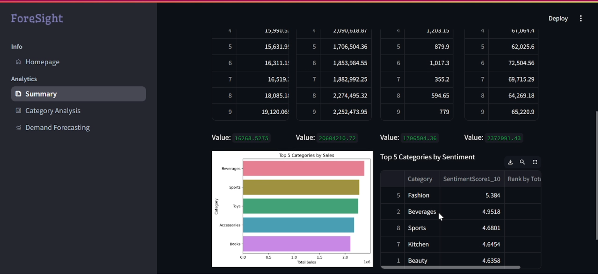

# **ForeSight: Advanced Retail Analytics Platform**

ForeSight is an advanced retail analytics platform that combines sentiment analysis, statistical sales analysis, and demand forecasting to provide actionable insights. It empowers businesses to understand customer behavior and make strategic decisions for growth and efficiency.

## **Table of Contents**

- [Introduction](#introduction)
- [Why This Project is Important](#why-this-project-is-important)
- [Project Objectives](#project-objectives)
- [Features](#features)
- [Folder Structure](#folder-structure)
- [Installation](#installation)
- [Running the Application](#running-the-application)
- [Data](#data)
- [Modules](#modules)
- [Simulation Example](#simulation-example)
- [Outputs](#outputs)
- [Built With](#built-with)
- [Authors](#authors)
- [Acknowledgments](#acknowledgments)

---

## **Introduction**

ForeSight is designed to provide comprehensive insights into sales trends and customer sentiment using a combination of data analysis techniques, sentiment analysis, and demand forecasting models. By leveraging advanced analytics, businesses can gain valuable insights to drive efficiency, enhance customer experiences, and optimize their strategies.

## **Why This Project is Important**

In today's highly competitive retail landscape, understanding customer preferences, sales patterns, and future demand is crucial for businesses to stay ahead. ForeSight addresses this need by combining advanced analytics, sentiment analysis, and forecasting techniques into a single platform, enabling businesses to make data-driven decisions, optimize their product offerings, and respond to market changes more effectively.

## **Project Objectives**

- **Understand Customer Sentiments**: Extract insights from customer reviews to identify areas of improvement and product strengths.
- **Analyze Sales Trends**: Use statistical analysis to understand historical sales trends, identify best-sellers, and detect seasonal patterns.
- **Forecast Demand**: Provide accurate demand forecasting to aid inventory management, sales planning, and strategic decision-making.
- **User Engagement**: Offer an interactive, user-friendly interface for businesses to explore and visualize insights effortlessly.

---

## **Features**

- **Sentiment Analysis**: Understand customer reviews and sentiments towards products, allowing for more effective product management.
- **Statistical Sales Analysis**: Gain insights into sales trends, patterns, and product performance over time.
- **Demand Forecasting**: Utilize advanced forecasting techniques to predict future sales demand, helping businesses plan inventory and sales strategies.
- **User-Friendly Interface**: Interactive dashboard built with Streamlit for easy navigation and insights visualization.

---

## **Folder Structure**

The repository is organized as follows:

```
ForeSight/
│
├── Datasets/
│   ├── category_avg_net_sentiments.csv
│   ├── ranked_products_with_net_sentiments.csv
│   ├── test_dataset_1.csv
│   └── test_dataset_2.csv
│
├── Extras/
│   ├── ForeSightExample.mp4
│   ├── ForeSightExample2.mp4
│   ├── Output1.png
│   ├── Output2.png
│   ├── Output3.png
│   ├── Output4.png
│   └── test
│
├── Jupyter/
│   ├── Product_Review_Sentiment_Analysis_Jupyter.ipynb
│   ├── category_avg_net_sentiments.csv
│   ├── products_sales_reviews_diverse .csv
│   ├── ranked_products_with_net_sentiments.csv
│   └── test.txt
│
├── Assets/
│   └── ForeSight.png
│
├── Views/
│   ├── category_analysis.py
│   ├── demand_forecasting.py
│   ├── homepage.py
│   └── summary.py
│
├── .gitattributes
├── ForeSight_Reviews_Sentiment_Analysis.ipynb
├── README.md
├── app.py
├── forecasting_arima.ipynb
├── foresight1.ipynb
├── requirements.txt
└── streamlit_app.py
```

- **Views**: Contains Python scripts responsible for different pages of the Streamlit application.
- **Assets**: Includes all the assets such as logos and images used for the web application.
- **Jupyter**: Contains the Jupyter Notebook used for initial analysis and sentiment analysis.
- **Datasets**: Contains the CSV files used for testing and simulation.

---

## **Installation**

To set up the application, follow these steps:

1. Clone the repository:
   ```bash
   git clone https://github.com/anujeshify/ForeSight.git
   ```
2. Navigate to the directory:
   ```bash
   cd ForeSight
   ```
3. Install the required packages:
   ```bash
   pip install -r requirements.txt
   ```

---

## **Running the Application**

To run the application, use the following command:

```bash
streamlit run app.py
```

The Streamlit application will launch, and you can access it via your web browser at `http://localhost:8501`.

---

## **Data**

The dataset `product_sales_reviews_diverse.csv` used in this project is created for simulation purposes and contains manually curated data for product reviews, sales, and other related attributes. The data is used to simulate a real-world scenario to demonstrate the platform's capabilities.

---

## **Modules**

### **Views**

- `category_analysis.py`: Contains code for analyzing product categories and their performance.
- `demand_forecasting.py`: Implements demand forecasting models to predict future sales.
- `homepage.py`: The main homepage script for the Streamlit application.
- `summary.py`: Provides a summary of key insights from the analysis.

### **Jupyter Notebooks**

- **Walmart_Sparkathon_Reviews_Sentiment_Analysis.ipynb**: Initial exploratory data analysis and sentiment analysis using reviews data.

### **Main Application Script**

- `app.py`: The main script to run the Streamlit application.

---

## **Simulation Example**

An example simulation with ForeSight would involve the following steps:
1. **Data Ingestion**: Load the `product_sales_reviews_diverse.csv` dataset containing product reviews, sales data, and other relevant information.
2. **Sentiment Analysis**: Analyze customer reviews to determine overall sentiment and identify key themes.
3. **Sales Analysis**: Visualize sales trends across different categories, identifying top-performing products and sales patterns.
4. **Demand Forecasting**: Utilize forecasting models to predict future sales trends, providing insights for inventory management and sales planning.


https://github.com/user-attachments/assets/88c02aba-c346-4525-b118-7600f7016380


The platform then displays these insights interactively, allowing businesses to explore and make data-driven decisions.

---

## **Outputs**

The outputs of the ForeSight platform are displayed in an interactive dashboard with the following key insights:

- **Sentiment Analysis**: Graphs and visualizations showcasing customer sentiment towards products.
- **Sales Analysis**: Insights into sales trends, including best-selling products, seasonal trends, and category-wise performance.
- **Demand Forecasting**: Forecasted sales trends displayed as graphs to help businesses plan inventory and marketing strategies.





These insights are presented through an easy-to-navigate interface, enabling users to drill down into details for strategic decision-making.

---

## **Built With**

- **Python**: Core programming language
- **Streamlit**: For building the web application
- **Pandas & NumPy**: For data manipulation and analysis
- **Scikit-learn**: For machine learning and predictive analytics
- **Matplotlib & Seaborn**: For data visualization
- **NLTK**: For sentiment analysis
- **ARIMA**: For demand forecasting

---

## **Authors**

- **Anujesh Bansal** - [anujeshify](https://github.com/anujeshify)
- **Divyansh Chauhan** - [DivR22](https://github.com/DivR22)
- **Khushi Goel** - [Khushigoel14](https://github.com/Khushigoel14)
- **Prachee Mohapatra** - [prachee04](https://github.com/prachee04)

---

## **Acknowledgments**

- Thanks to the creators of Streamlit, Pandas, and Scikit-learn for their incredible tools.
- Special thanks to all contributors who provided valuable feedback during the development of ForeSight.
